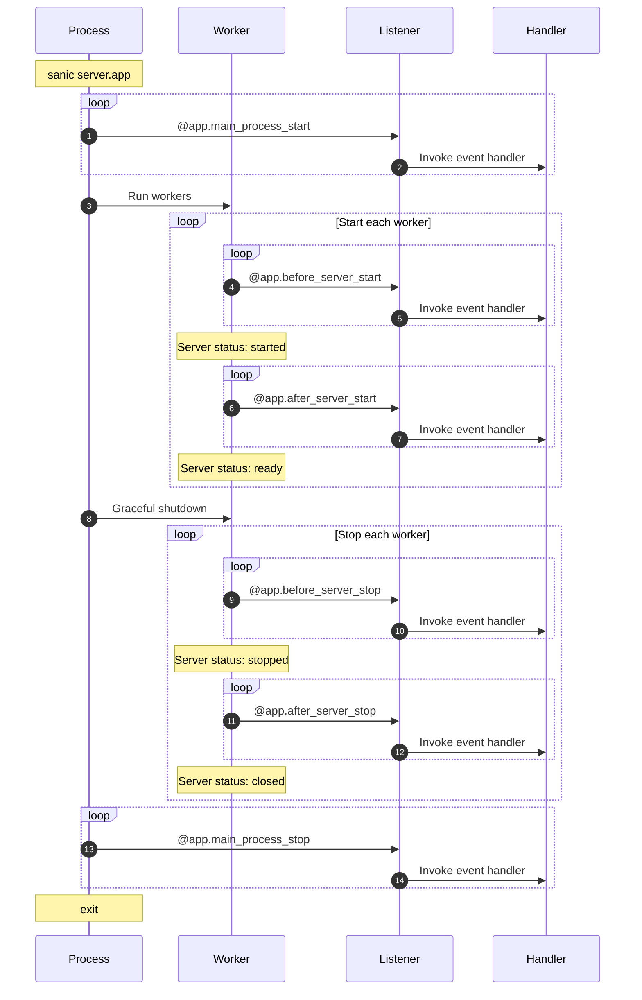

# Listeners

Sanic provides you with six (6) opportunities to inject an operation into the life cycle of your application. 

::: new NEW in v21.3
There are two (2) that run **only** on your main Sanic process (ie, once per call to `sanic server.app`.)

- `main_process_start`
- `main_process_stop`
:::

There are four (4) that enable you to execute startup/teardown code as your server starts or closes.

- `before_server_start`
- `after_server_start`
- `before_server_stop`
- `after_server_stop`

The life cycle of a worker process looks like this:


## Attaching a listener

---:1

The process to setup a function as a listener is similar to declaring a route.

The two injected arguments are the currently running `Sanic()` instance, and the currently running loop.
:--:1
```python
async def setup_db(app, loop):
    app.db = await db_setup()

app.register_listener(setup_db, "before_server_start")
```
:---

---:1

The `Sanic` app instance also has a convenience decorator.
:--:1
```python
@app.listener("before_server_start")
async def setup_db(app, loop):
    app.db = await db_setup()
```
:---

---:1
::: new NEW in v21.3
You can shorten the decorator even further. This is helpful if you have an IDE with autocomplete.
:::
:--:1
```python
@app.before_server_start
async def setup_db(app, loop):
    app.db = await db_setup()
```
:---

## Order of execution

Listeners are executed in the order they are declared during startup, and reverse order of declaration during teardown

|                       | Phase           | Order   |
|-----------------------|-----------------|---------|
| `main_process_start`  | main startup    | regular :smiley: |
| `before_server_start` | worker startup  | regular :smiley: |
| `after_server_start`  | worker startup  | regular :smiley: |
| `before_server_stop`  | worker shutdown | reverse :upside_down_face: |
| `after_server_stop`   | worker shutdown | reverse :upside_down_face: |
| `main_process_stop`   | main shutdown   | reverse :upside_down_face: |

Given the following setup, we should expect to see this in the console if we run two workers.

---:1

```python
@app.listener("before_server_start")
async def listener_1(app, loop):
    print("listener_1")

@app.before_server_start
async def listener_2(app, loop):
    print("listener_2")

@app.listener("after_server_start")
async def listener_3(app, loop):
    print("listener_3")

@app.after_server_start
async def listener_4(app, loop):
    print("listener_4")

@app.listener("before_server_stop")
async def listener_5(app, loop):
    print("listener_5")

@app.before_server_stop
async def listener_6(app, loop):
    print("listener_6")

@app.listener("after_server_stop")
async def listener_7(app, loop):
    print("listener_7")

@app.after_server_stop
async def listener_8(app, loop):
    print("listener_8")
```
:--:1
```bash{3-7,13,19-22}
[pid: 1000000] [INFO] Goin' Fast @ http://127.0.0.1:9999
[pid: 1000000] [INFO] listener_0
[pid: 1111111] [INFO] listener_1
[pid: 1111111] [INFO] listener_2
[pid: 1111111] [INFO] listener_3
[pid: 1111111] [INFO] listener_4
[pid: 1111111] [INFO] Starting worker [1111111]
[pid: 1222222] [INFO] listener_1
[pid: 1222222] [INFO] listener_2
[pid: 1222222] [INFO] listener_3
[pid: 1222222] [INFO] listener_4
[pid: 1222222] [INFO] Starting worker [1222222]
[pid: 1111111] [INFO] Stopping worker [1111111]
[pid: 1222222] [INFO] Stopping worker [1222222]
[pid: 1222222] [INFO] listener_6
[pid: 1222222] [INFO] listener_5
[pid: 1222222] [INFO] listener_8
[pid: 1222222] [INFO] listener_7
[pid: 1111111] [INFO] listener_6
[pid: 1111111] [INFO] listener_5
[pid: 1111111] [INFO] listener_8
[pid: 1111111] [INFO] listener_7
[pid: 1000000] [INFO] listener_9
[pid: 1000000] [INFO] Server Stopped
```
In the above example, notice how there are three processes running:

- `pid: 1000000` - The *main* process
- `pid: 1111111` - Worker 1
- `pid: 1222222` - Worker 2

*Just because our example groups all of one worker and then all of another, in reality since these are running on separate processes, the ordering between processes is not guaranteed. But, you can be sure that a single worker will **always** maintain its order.*
:---


::: tip FYI
The practical result of this is that if the first listener in `before_server_start` handler setups a database connection, listeners that are registered after it can rely upon that connection being alive both when they are started and stopped.
:::

## ASGI Mode

If you are running your application with an ASGI server, then make note of the following changes:

- `main_process_start` and `main_process_stop` will be **ignored**
- `before_server_start` will run as early as it can, and will be before `after_server_start`, but technically, the server is already running at that point
- `after_server_stop` will run as late as it can, and will be after `before_server_stop`, but technically, the server is still running at that point
