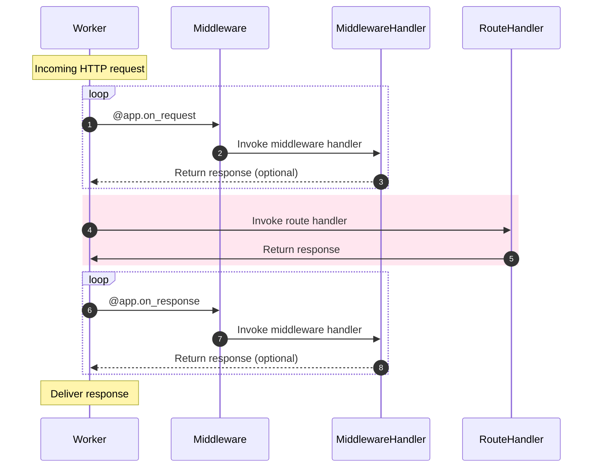

# Middleware

Whereas listeners allow you to attach functionality to the lifecycle of a worker process, middleware allows you to attach functionality to the lifecycle of an HTTP stream.

You can execute middleware either _before_ the handler is executed, or _after_.


## Attaching middleware

---:1

This should probably look familar by now. All you need to do is declare when you would like the middleware to execute: on the `request` or on the `response`.
:--:1
```python
async def extract_user(request):
    request.ctx.user = await extract_user_from_request(request)

app.register_middleware(extract_user, "request")
```
:---

---:1

Again, the `Sanic` app instance also has a convenience decorator.
:--:1
```python
@app.middleware("request")
async def extract_user(request):
    request.ctx.user = await extract_user_from_request(request)
```
:---

---:1

Response middleware receives both the `request` and `response` arguments.
:--:1
```python
@app.middleware('response')
async def prevent_xss(request, response):
    response.headers["x-xss-protection"] = "1; mode=block"
```
:---

---:1

::: new NEW in v21.3
You can shorten the decorator even further. This is helpful if you have an IDE with autocomplete.
:::
:--:1
```python
@app.on_request
async def extract_user(request):
    ...

@app.on_response
async def prevent_xss(request, response):
    ...
```
:---

## Modification

---:1

Middleware can modify the request or response parameter it is given, _as long as it does not return it_.

#### Order of execution

1. Request middleware: `add_key`
2. Route handler: `index`
3. Response middleware: `prevent_xss`
4. Response middleware: `custom_banner`
:--:1
```python
@app.middleware("request")
async def add_key(request):
    # Arbitrary data may be stored in request context:
    request.ctx.foo = "bar"


@app.middleware("response")
async def custom_banner(request, response):
    response.headers["Server"] = "Fake-Server"


@app.middleware("response")
async def prevent_xss(request, response):
    response.headers["x-xss-protection"] = "1; mode=block"


@app.get("/")
async def index(request):
    return text(request.ctx.foo)

```
:---


---:1
::: new NEW in v21.3
You can modify the `request.match_info`. A useful feature that could be used, for example, in middleware to convert `a-slug` to `a_slug`.
:::
:--:1
```python
@app.on_request
def convert_slug_to_underscore(request: Request):
    request._match_info["slug"] = request._match_info["slug"].replace("-", "_")


@app.get("/<slug:[a-z0-9]+(?:-[a-z0-9]+)*>")
async def handler(request, slug):
    return text(slug)
```
```
$ curl localhost:9999/foo-bar-baz
foo_bar_baz
```
:---
## Resonding early

---:1

If middleware returns a `HTTPResponse` object, the request will stop processing and the response will be returned. If this occurs to a request before the route handler is reached, the handler will **not** be called. Returning a response will also prevent any further middleware from running.
:--:1
```python
@app.middleware("request")
async def halt_request(request):
    return text("I halted the request")

@app.middleware("response")
async def halt_response(request, response):
    return text("I halted the response")
```
:---

#### Order of execution

Request middleware is executed in the order declared. Response middleware is executed in **reverse order**.

Given the following setup, we should expect to see this in the console.

---:1

```python
@app.middleware("request")
async def middleware_1(request):
    print("middleware_1")


@app.middleware("request")
async def middleware_2(request):
    print("middleware_2")


@app.middleware("response")
async def middleware_3(request, response):
    print("middleware_3")


@app.middleware("response")
async def middleware_4(request, response):
    print("middleware_4")
    
@app.get("/handler")
async def handler(request):
    print("~ handler ~")
    return text("Done.")
```
:--:1
```bash
middleware_1
middleware_2
~ handler ~
middleware_4
middleware_3
[INFO][127.0.0.1:44788]: GET http://localhost:8000/handler  200 5
```
:---
