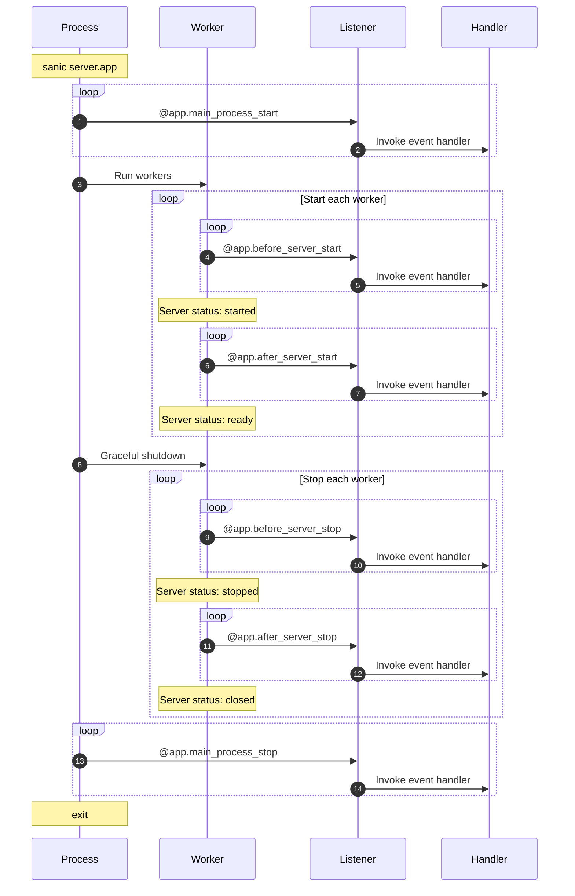

# Listeners

Sanicは、アプリケーションのライフサイクルにオペレーションを注入する6つの機会を提供します。This does not include the [signals](../advanced/signals.md), which allow further injection customization.

メインのSanicプロセスで**のみ**を実行するものが2つあります(つまり、`sanic server.app`への呼び出しごとに1回です)。

- `main_process_start`
- `main_process_stop`

There are also two (2) that run **only** in a reloader process if auto-reload has been turned on.

- `reload_process_start`
- `reload_process_stop`

*Added `reload_process_start` and `reload_process_stop` in v22.3*

サーバの起動時または終了時にスタートアップ/ティアダウンコードを実行できるようにするには、4つの方法があります。

- `before_server_start`
- `after_server_start`
- `before_server_stop`
- `after_server_stop`

ワーカプロセスのライフサイクルは次のようになります。



The reloader process live outside of this worker process inside of a process that is responsible for starting and stopping the Sanic processes. Consider the following example:

```python
@app.reload_process_start
async def reload_start(*_):
    print(">>>>>> reload_start <<<<<<")
@app.main_process_start
async def main_start(*_):
    print(">>>>>> main_start <<<<<<")
```

If this application were run with auto-reload turned on, the `reload_start` function would be called once. This is contrasted with `main_start`, which would be run every time a file is save and the reloader restarts the applicaition process.

## Attaching a listener

---:1

関数をリスナーとして設定するプロセスは、ルートの宣言に似ています。

The currently running `Sanic()` instance is injected into the listener.
:--:1
```python
async def setup_db(app,):
    app.ctx.db = await db_setup()

app.register_listener(setup_db, "before_server_start")
```
:---

---:1

`Sanic`アプリインスタンスにも便利なデコレーターがある。
:--:1
```python
@app.listener("before_server_start")
async def setup_db(app, loop):
    app.ctx.db = await db_setup()
```
:---

---:1

デコレーターをさらに短くすることができます。これは、オートコンプリート機能を備えたIDEがある場合に便利です。

:--:1
```python
@app.before_server_start
async def setup_db(app, loop):
    app.ctx.db = await db_setup()
```
:---

## Order of execution

リスナーは、起動時に宣言された順序で実行され、ティアダウン時に宣言された順序とは逆の順序で実行されます。

|                       | Phase           | Order   |
|-----------------------|-----------------|---------|
| `main_process_start`  | main startup    | regular :smiley: |
| `before_server_start` | worker startup  | regular :smiley: |
| `after_server_start`  | worker startup  | regular :smiley: |
| `before_server_stop`  | worker shutdown | reverse :upside_down_face: |
| `after_server_stop`   | worker shutdown | reverse :upside_down_face: |
| `main_process_stop`   | main shutdown   | reverse :upside_down_face: |

次の設定では、2人のワーカーを実行した場合にコンソールにこのメッセージが表示されます。

---:1

```python
@app.listener("before_server_start")
async def listener_1(app, loop):
    print("listener_1")

@app.before_server_start
async def listener_2(app, loop):
    print("listener_2")

@app.listener("after_server_start")
async def listener_3(app, loop):
    print("listener_3")

@app.after_server_start
async def listener_4(app, loop):
    print("listener_4")

@app.listener("before_server_stop")
async def listener_5(app, loop):
    print("listener_5")

@app.before_server_stop
async def listener_6(app, loop):
    print("listener_6")

@app.listener("after_server_stop")
async def listener_7(app, loop):
    print("listener_7")

@app.after_server_stop
async def listener_8(app, loop):
    print("listener_8")
```
:--:1
```bash{3-7,13,19-22}
[pid: 1000000] [INFO] Goin' Fast @ http://127.0.0.1:9999
[pid: 1000000] [INFO] listener_0
[pid: 1111111] [INFO] listener_1
[pid: 1111111] [INFO] listener_2
[pid: 1111111] [INFO] listener_3
[pid: 1111111] [INFO] listener_4
[pid: 1111111] [INFO] Starting worker [1111111]
[pid: 1222222] [INFO] listener_1
[pid: 1222222] [INFO] listener_2
[pid: 1222222] [INFO] listener_3
[pid: 1222222] [INFO] listener_4
[pid: 1222222] [INFO] Starting worker [1222222]
[pid: 1111111] [INFO] Stopping worker [1111111]
[pid: 1222222] [INFO] Stopping worker [1222222]
[pid: 1222222] [INFO] listener_6
[pid: 1222222] [INFO] listener_5
[pid: 1222222] [INFO] listener_8
[pid: 1222222] [INFO] listener_7
[pid: 1111111] [INFO] listener_6
[pid: 1111111] [INFO] listener_5
[pid: 1111111] [INFO] listener_8
[pid: 1111111] [INFO] listener_7
[pid: 1000000] [INFO] listener_9
[pid: 1000000] [INFO] Server Stopped
```
上の例では、3つのプロセスが実行されています。

- `pid: 1000000` - The *main* process
- `pid: 1111111` - Worker 1
- `pid: 1222222` - Worker 2

*この例では、1つのワーカーをすべてグループ化し、次に別のワーカーをすべてグループ化していますが、実際にはこれらのワーカーは別々のプロセスで実行されているため、プロセス間の順序付けは保証されません。ただし、1人のワーカーが常にその順序を維持することは確実です。*
:---


::: tip FYI
The practical result of this is that if the first listener in `before_server_start` handler setups a database connection, listeners that are registered after it can rely upon that connection being alive both when they are started and stopped.
:::

## ASGI Mode

実際には、`before_server_start`ハンドラの最初のリスナーがデータベース接続を設定すると、その後に登録されたリスナーは、起動時と停止時の両方でその接続が有効であることを信頼できます。

- `main_process_start`と`main_process_stop`は**無視されます。**
- `before_server_start`はできるだけ早く動きます。,そして`after_server_start`の前に実行されます。, しかし、技術的には、サーバーはすでにその時点で実行されています
- `after_server_stop`はできるだけ遅く実行され、`before_server_stop`の後になりますが、技術的には、サーバーはまだその時点で実行されています
