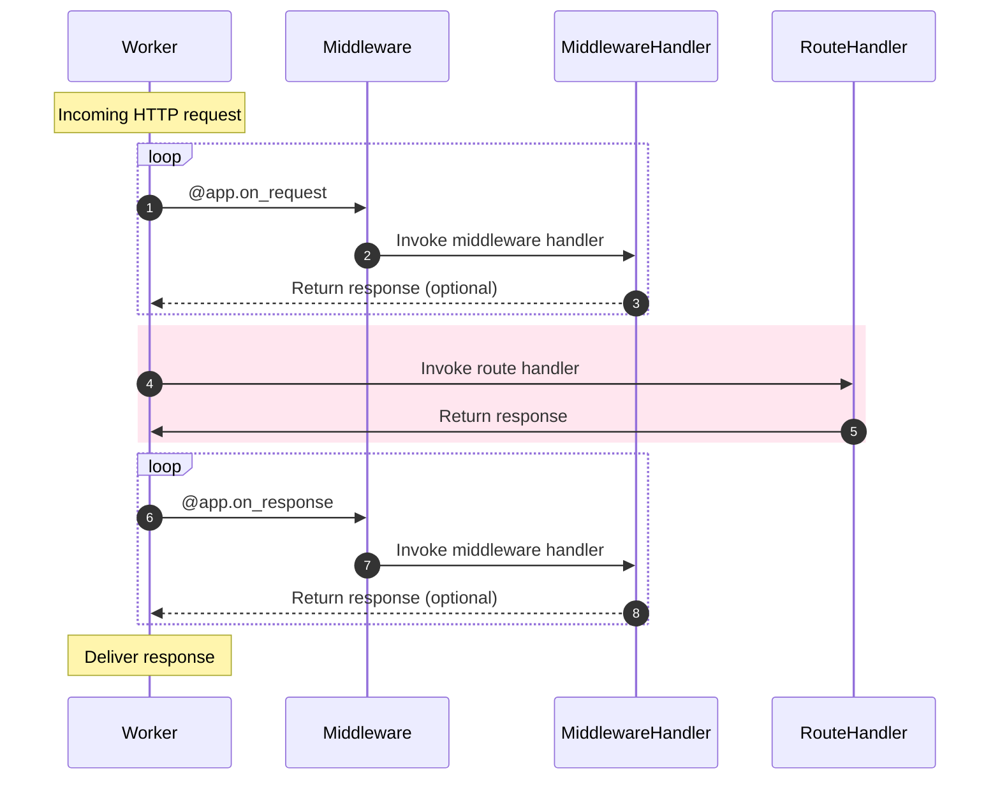

# Middleware

リスナーではワーカー・プロセスのライフサイクルに機能を付加できますが、ミドルウェアではHTTPストリームのライフサイクルに機能を付加できます。

ミドルウェアを実行するには、_before_ハンドラを実行するか_after_を実行します。


## Attaching middleware

---:1

これはもう見慣れたものになっているはずです。 All you need to do is declare when you would like the middleware to execute: on the `request` or on the `response`. :--:1
```python
async def extract_user(request):
    request.ctx.user = await extract_user_from_request(request)

app.register_middleware(extract_user, "request")
```
:---

---:1

ここでも、`Sanic`アプリインスタンスには便利なデコレーターもある。 :--:1 :--:1
```python
@app.middleware("request")
async def extract_user(request):
    request.ctx.user = await extract_user_from_request(request)
```
:---

---:1

レスポンス・ミドルウェアは`request`と`response`の両方の引数を受け取ります。 :--:1 :--:1
```python
@app.middleware('response')
async def prevent_xss(request, response):
    response.headers["x-xss-protection"] = "1; mode=block"
```
:---

---:1

デコレーターをさらに短くすることができます。 これは、オートコンプリート機能を備えたIDEがある場合に便利です。 :--:1 :--:1
```python
@app.on_request
async def extract_user(request):
    ...

@app.on_response
async def prevent_xss(request, response):
    ...
```
:---

## Modification

---:1

ミドルウェアは、_を返さない限り、指定されたリクエストまたはレスポンス・パラメータを変更できます。

#### Order of execution

1. Request middleware: `add_key`
2. Route handler: `index`
3. Response middleware: `prevent_xss`
4. Response middleware: `custom_banner` :--:1
```python
@app.middleware("request")
async def add_key(request):
    # Arbitrary data may be stored in request context:
    request.ctx.foo = "bar"


@app.middleware("response")
async def custom_banner(request, response):
    response.headers["Server"] = "Fake-Server"


@app.middleware("response")
async def prevent_xss(request, response):
    response.headers["x-xss-protection"] = "1; mode=block"


@app.get("/")
async def index(request):
    return text(request.ctx.foo)

```
:---


---:1 `request.match_info`を変更できます。 たとえば、ミドルウェアで`a-slug`を`a_slug`に変換するために使用できる便利な機能。 :--:1 :--:1
```python
@app.on_request
def convert_slug_to_underscore(request: Request):
    request._match_info["slug"] = request._match_info["slug"].replace("-", "_")


@app.get("/<slug:[a-z0-9]+(?:-[a-z0-9]+)*>")
async def handler(request, slug):
    return text(slug)
```
```
$ curl localhost:9999/foo-bar-baz
foo_bar_baz
```
:---
## Responding early

---:1

ミドルウェアが`HTTPResponse`オブジェクトを返す場合、リクエストは処理を停止し、レスポンスが返されます。 これがルートハンドラに到達する前のリクエストで発生した場合、ハンドラは**not**呼び出されます。 レスポンスを返すと、それ以降のミドルウェアの実行も妨げられます。

::: tip `None`値を返すと、ミドルウェアハンドラの実行を停止して、リクエストを通常どおりに処理できます。 This can be useful when using early return to avoid processing requests inside of that middleware handler. ::: :--:1
```python
@app.middleware("request")
async def halt_request(request):
    return text("I halted the request")

@app.middleware("response")
async def halt_response(request, response):
    return text("I halted the response")
```
:---

#### Order of execution

リクエスト・ミドルウェアは、宣言された順序で実行されます。 レスポンス・ミドルウェアは、**逆順で実行されます**.

次の設定では、コンソールにこのメッセージが表示されます。

---:1

```python
@app.middleware("request")
async def middleware_1(request):
    print("middleware_1")


@app.middleware("request")
async def middleware_2(request):
    print("middleware_2")


@app.middleware("response")
async def middleware_3(request, response):
    print("middleware_3")


@app.middleware("response")
async def middleware_4(request, response):
    print("middleware_4")

@app.get("/handler")
async def handler(request):
    print("~ handler ~")
    return text("Done.")
```
:--:1
```bash
middleware_1
middleware_2
~ handler ~
middleware_4
middleware_3
[INFO][127.0.0.1:44788]: GET http://localhost:8000/handler  200 5
```
:---
