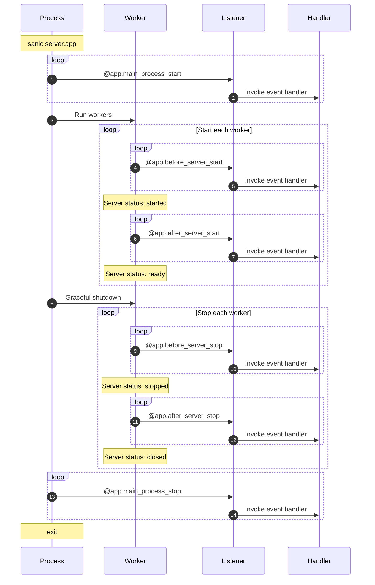

# 리스너(Listeners)

Sanic은 애플리케이션의 수명주기에 작업을 삽입 할 수있는 6번의 기회를 제공합니다.

기본 Sanic 프로세스에서 **만** 실행되는 2가지가 있습니다 (즉,`sanic server.app` 호출 당 한 번).

- `main_process_start`
- `main_process_stop`
:::

서버가 시작되거나 닫힐 때 시작/삭제 코드를 실행할 수 있는 4가지가 있습니다.

- `before_server_start`
- `after_server_start`
- `before_server_stop`
- `after_server_stop`

작업자 프로세스의 수명 주기는 다음과 같습니다.:



## 리스너 연결(Attaching a listener)

---:1

함수를 리스너로 설정하는 프로세스는 경로(routes)를 선언하는 것과 유사합니다.

삽입 된 두 개의 인수는 현재 실행중인 `Sanic ()` 인스턴스와 현재 실행중인 루프입니다.

:--:1

```python
async def setup_db(app, loop):
    app.db = await db_setup()

app.register_listener(setup_db, "before_server_start")
```

:---

---:1

`Sanic` 앱 인스턴스에는 편리한 데코레이터도 있습니다.

:--:1

```python
@app.listener("before_server_start")
async def setup_db(app, loop):
    app.db = await db_setup()
```

:---

---:1

데코레이터를 더 줄일 수 있습니다. 자동 완성 기능이있는 IDE가있는 경우 유용합니다.
:::
:--:1

```python
@app.before_server_start
async def setup_db(app, loop):
    app.db = await db_setup()
```

:---

## 실행 순서(Order of execution)

리스너는 시작시 선언 된 순서대로 실행되고 해체시 선언의 역순으로 실행됩니다.

|                       | Phase           | Order                      |
| --------------------- | --------------- | -------------------------- |
| `main_process_start`  | main startup    | regular :smiley:           |
| `before_server_start` | worker startup  | regular :smiley:           |
| `after_server_start`  | worker startup  | regular :smiley:           |
| `before_server_stop`  | worker shutdown | reverse :upside_down_face: |
| `after_server_stop`   | worker shutdown | reverse :upside_down_face: |
| `main_process_stop`   | main shutdown   | reverse :upside_down_face: |

다음 설정이 주어지면 두 작업자를 실행하면 콘솔에서 이를 볼 수 있습니다.

---:1

```python
@app.listener("before_server_start")
async def listener_1(app, loop):
    print("listener_1")

@app.before_server_start
async def listener_2(app, loop):
    print("listener_2")

@app.listener("after_server_start")
async def listener_3(app, loop):
    print("listener_3")

@app.after_server_start
async def listener_4(app, loop):
    print("listener_4")

@app.listener("before_server_stop")
async def listener_5(app, loop):
    print("listener_5")

@app.before_server_stop
async def listener_6(app, loop):
    print("listener_6")

@app.listener("after_server_stop")
async def listener_7(app, loop):
    print("listener_7")

@app.after_server_stop
async def listener_8(app, loop):
    print("listener_8")
```

:--:1

```bash{3-7,13,19-22}
[pid: 1000000] [INFO] Goin' Fast @ http://127.0.0.1:9999
[pid: 1000000] [INFO] listener_0
[pid: 1111111] [INFO] listener_1
[pid: 1111111] [INFO] listener_2
[pid: 1111111] [INFO] listener_3
[pid: 1111111] [INFO] listener_4
[pid: 1111111] [INFO] Starting worker [1111111]
[pid: 1222222] [INFO] listener_1
[pid: 1222222] [INFO] listener_2
[pid: 1222222] [INFO] listener_3
[pid: 1222222] [INFO] listener_4
[pid: 1222222] [INFO] Starting worker [1222222]
[pid: 1111111] [INFO] Stopping worker [1111111]
[pid: 1222222] [INFO] Stopping worker [1222222]
[pid: 1222222] [INFO] listener_6
[pid: 1222222] [INFO] listener_5
[pid: 1222222] [INFO] listener_8
[pid: 1222222] [INFO] listener_7
[pid: 1111111] [INFO] listener_6
[pid: 1111111] [INFO] listener_5
[pid: 1111111] [INFO] listener_8
[pid: 1111111] [INFO] listener_7
[pid: 1000000] [INFO] listener_9
[pid: 1000000] [INFO] Server Stopped
```

위의 예에서는 세 가지 프로세스가 어떻게 실행 중인지 알아봅니다:

- `pid: 1000000` - The *main* process
- `pid: 1111111` - Worker 1
- `pid: 1222222` - Worker 2

*이 예제에서는 한 작업자를 모두 그룹화 한 다음 다른 작업자를 모두 그룹화하기 때문에 실제로는 별도의 프로세스에서 실행되기 때문에 프로세스 간의 순서가 보장되지 않습니다. 그러나 한 명의 작업자가 **항상** 순서를 유지할 것임을 확신 할 수 있습니다.*
:---

::: tip FYI
실제로 사용하는 경우 데이터베이스 연결 함수를 정의하고 `before_server_start`의 첫 번째 리스너로 등록하면 그 이후에 등록 된 모든 리스너가 연결에 의존하여 활성 상태를 유지할 수 있습니다.
:::

## ASGI 모드(ASGI Mode)

ASGI 서버에서 응용 프로그램을 실행하는 경우 다음 변경 사항을 기록하십시오:

- `main_process_start` 및`main_process_stop`은 **무시됩니다**
- `before_server_start`는 가능한 한 빨리 실행되고`after_server_start` 이전에 실행되지만 기술적으로 서버는 이미 해당 지점에서 실행 중입니다.
- `after_server_stop`은 가능한 한 늦게 실행되고 `before_server_stop` 이후에 실행되지만 기술적으로 서버는 여전히 그 시점에서 실행됩니다.
