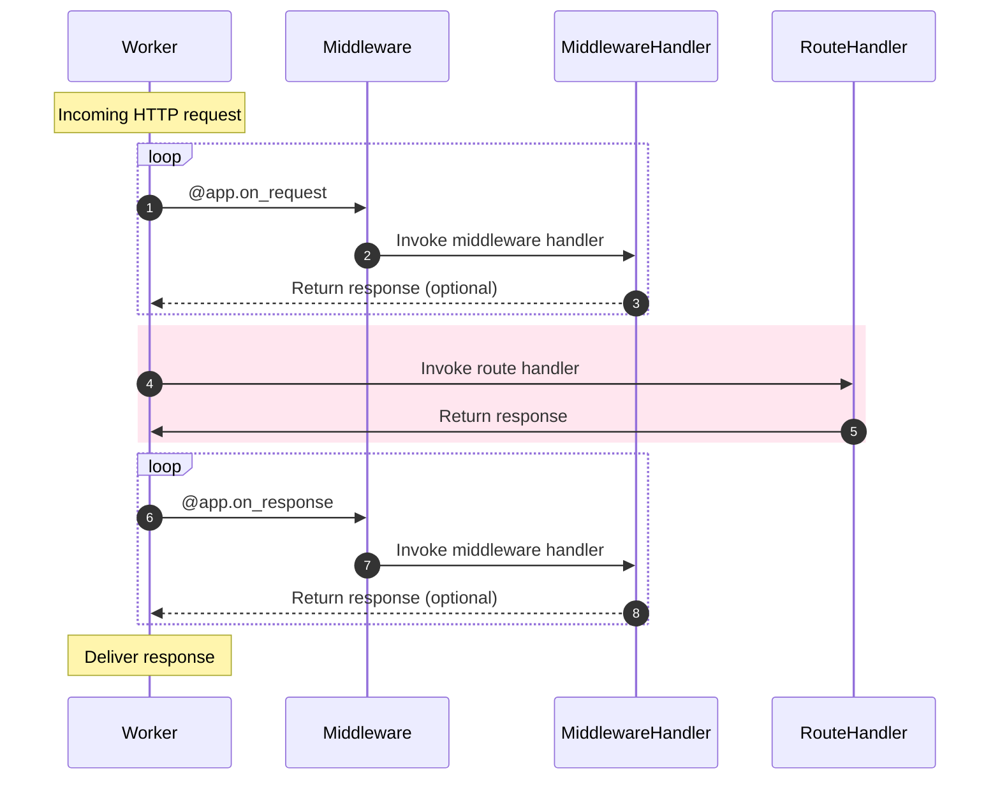

# 미들웨어(Middleware)

리스너를 사용하면 작업자 프로세스의 수명 주기에 기능을 연결할 수 있지만 미들웨어를 사용하면 HTTP 스트림의 수명 주기에 기능을 연결할 수 있습니다.

You can execute middleware either _before_ the handler is executed, or _after_.


## 미들웨어 연결(Attaching middleware)

---:1

이것은 아마 지금쯤 친숙해 보일 것입니다. 당신이 해야 할 일은 미들웨어가 실행되기를 원하는 때를 선언하는 것뿐입니다: `request` 또는 `response`. :--:1
```python
async def extract_user(request):
    request.ctx.user = await extract_user_from_request(request)

app.register_middleware(extract_user, "request")
```
:---

---:1

다시 말하지만, `Sanic` 앱 인스턴스에는 편리한 데코레이터도 있습니다. :--:1
```python
@app.middleware("request")
async def extract_user(request):
    request.ctx.user = await extract_user_from_request(request)
```
:---

---:1

응답 미들웨어는 `request` 및 `response` 인수를 모두 받습니다. :--:1
```python
@app.middleware('response')
async def prevent_xss(request, response):
    response.headers["x-xss-protection"] = "1; mode=block"
```
:---

---:1

데코레이터를 더 줄일 수 있습니다. 이는 자동 완성 기능이 있는 IDE가 있는 경우에 유용합니다.

This is the preferred usage, and is what we will use going forward.

::: :--:1
```python
@app.on_request
async def extract_user(request):
    ...

@app.on_response
async def prevent_xss(request, response):
    ...
```
:---

## 수정(Modification)

---:1

미들웨어는 _반환하지 않는 한_ 제공된 요청 또는 응답 매개변수를 수정할 수 있습니다.

#### 실행 순서(Order of execution)

1. 미들웨어 요청: `add_key`
2. 라우트 핸들러: `index`
3. 응답 미들웨어: `prevent_xss`
4. 응답 미들웨어: `custom_banner`
```python
@app.on_request
async def add_key(request):
    # Arbitrary data may be stored in request context:
    request.ctx.foo = "bar"


@app.on_response
async def custom_banner(request, response):
    response.headers["Server"] = "Fake-Server"


@app.on_response
async def prevent_xss(request, response):
    response.headers["x-xss-protection"] = "1; mode=block"


@app.get("/")
async def index(request):
    return text(request.ctx.foo)

```
:---


`request.match_info`를 수정할 수 있습니다. 예를 들어 미들웨어에서 `a-slug`를 `a_slug`로 변환하는 데 사용할 수 있는 유용한 기능입니다. :--:1
```python
@app.on_request
def convert_slug_to_underscore(request: Request):
    request.match_info["slug"] = request.match_info["slug"].replace("-", "_")


@app.get("/<slug:slug>")
async def handler(request, slug):
    return text(slug)
```
```
$ curl localhost:9999/foo-bar-baz
foo_bar_baz
```
:---
## 일찍 응답하기(Responding early)

---:1

미들웨어가 `HTTPResponse` 객체를 반환하면 요청 처리가 중지되고 응답이 반환됩니다. 라우트 핸들러에 도달하기 전에 요청에 이 문제가 발생하면 핸들러가 호출되지 **않습니다**. 응답을 반환하면 더 이상 미들웨어가 실행되지 않습니다.

::: tip You can return a `None` value to stop the execution of the middleware handler to allow the request to process as normal. This can be useful when using early return to avoid processing requests inside of that middleware handler. ::: :--:1
```python
@app.on_request
async def halt_request(request):
    return text("I halted the request")

@app.on_response
async def halt_response(request, response):
    return text("I halted the response")
```
:---

## 실행 순서(Order of execution)

요청 미들웨어는 선언된 순서대로 실행됩니다. 응답 미들웨어는 **역순**으로 실행됩니다.

다음 설정이 주어지면 콘솔에서 이를 볼 수 있을 것으로 예상해야 합니다

---:1
```python
@app.on_request
async def middleware_1(request):
    print("middleware_1")


@app.on_request
async def middleware_2(request):
    print("middleware_2")


@app.on_response
async def middleware_3(request, response):
    print("middleware_3")


@app.on_response
async def middleware_4(request, response):
    print("middleware_4")

@app.get("/handler")
async def handler(request):
    print("~ handler ~")
    return text("Done.")
```
:--:1
```bash
middleware_1
middleware_2
~ handler ~
middleware_4
middleware_3
[INFO][127.0.0.1:44788]: GET http://localhost:8000/handler  200 5
```
:---

::: new NEW in v22.9
### Middleware priority

---:1 You can modify the order of execution of middleware by assigning it a higher priority. This happens inside of the middleware definition. The higher the value, the earlier it will execute relative to other middleware. The default priority for middleware is `0`. :--:1
```python
@app.on_request
async def low_priority(request):
    ...

@app.on_request(priority=99)
async def high_priority(request):
    ...
```
:--- :::
