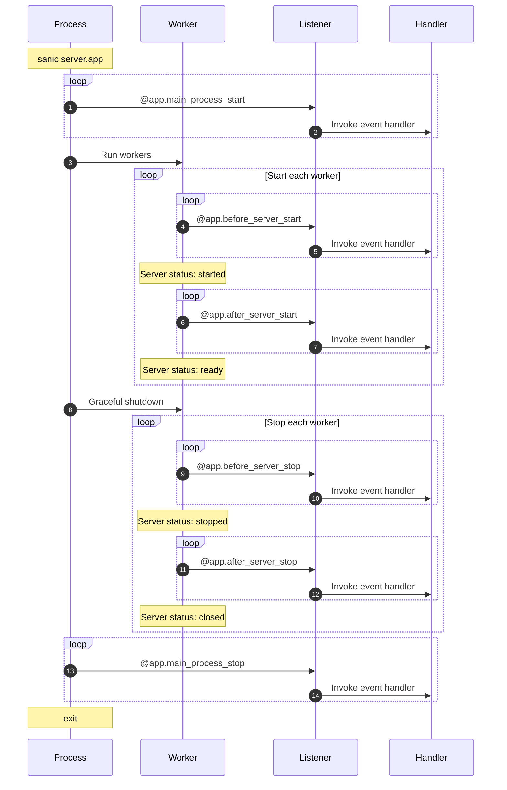

# Обработчики событий

Sanic предоставляет восемь (8) вариантов включения операции в жизненный цикл вашего сервера приложений. Это не включает [сигналы](../advanced/signals.md), которые позволяют продолжить настройку инъекций.

Два (2) из них выполняются **только** в вашем главном процессе Sanic (то есть, один раз за обращение к `sanic server.app`.)

- `main_process_start`
- `main_process_stop`

Ещё два (2) выполняются **только** в процессе перезагрузки, если включена автоматическая перезагрузка.

- `reload_process_start`
- `reload_process_stop`

*`reload_process_start` и `reload_process_stop` добавлены в v22.3*

И наконец оставшиеся четыре (4) варианта, которые позволяют вам выполнить подготовительный/очищающий код при запуске или остановке сервера.

- `before_server_start`
- `after_server_start`
- `before_server_stop`
- `after_server_stop`

Жизненный цикл рабочего процесса выглядит так:



Процесс перезагрузчика существует не в этом процессе, а внутри процесса, который отвечает за запуск и остановку Sanic процессов. Рассмотрим следующий пример:

```python
@app.reload_process_start
async def reload_start(*_):
    print(">>>>>> reload_start <<<<<<")


@app.main_process_start
async def main_start(*_):
    print(">>>>>> main_start <<<<<<")
```

Если это приложение было запущено с включенной автоматической перезагрузкой, функция `reload_start` будет вызвана один раз. Это контрастирует с `main_start`, который будет запускаться каждый раз при сохранении файла и перезапуске перезагрузчиком процесса приложения.

## Подключение обработчика событий

---:1

Процесс настройки функции в качестве обработчика событий похож на определение маршрута.

В обработчик пробрасывается экземпляр текущего запущенного приложения `Sanic()`. :--:1
```python
async def setup_db(app):
    app.ctx.db = await db_setup()

app.register_listener(setup_db, "before_server_start")
```
:---

---:1

У экземпляра приложения `Sanic` также есть удобный декоратор для этого. :--:1
```python
@app.listener("before_server_start")
async def setup_db(app):
    app.ctx.db = await db_setup()
```
:---

---:1 До v22.3 в функцию необходимо было пробрасывать и экземпляр приложения, и текущий цикл событий. Тем не менее, по умолчанию требуется только экземпляр приложения. Если сигнатура функции будет принимать и то, и другое, то оба этих параметра будут использованы, как показано ниже. :--:1
```python
@app.listener("before_server_start")
async def setup_db(app, loop):
    app.ctx.db = await db_setup()
```
:---

---:1

Декоратор же можно сократить еще больше. Это полезно, если у вас есть IDE с автозавершением.

:--:1
```python
@app.before_server_start
async def setup_db(app):
    app.ctx.db = await db_setup()
```
:---

## Порядок выполнения

Во время запуска обработчики событий выполняются в порядке, в котором они объявлены и в обратном порядке во время остановки сервера

|                       | Этап                        | Порядок                       |
| --------------------- | --------------------------- | ----------------------------- |
| `main_process_start`  | запуск главного процесса    | обычный :smiley:              |
| `before_server_start` | запуск воркера              | обычный :smiley:              |
| `after_server_start`  | запуск воркера              | обычный :smiley:              |
| `before_server_stop`  | остановка воркера           | обратный :upside_down_face: |
| `after_server_stop`   | остановка воркера           | обратный :upside_down_face: |
| `main_process_stop`   | остановка главного процесса | обратный :upside_down_face: |

Если мы запустим два воркера с указанными ниже настройками, то в консоли мы можем ожидать следующий вывод.

---:1

```python
@app.listener("before_server_start")
async def listener_1(app, loop):
    print("listener_1")

@app.before_server_start
async def listener_2(app, loop):
    print("listener_2")

@app.listener("after_server_start")
async def listener_3(app, loop):
    print("listener_3")

@app.after_server_start
async def listener_4(app, loop):
    print("listener_4")

@app.listener("before_server_stop")
async def listener_5(app, loop):
    print("listener_5")

@app.before_server_stop
async def listener_6(app, loop):
    print("listener_6")

@app.listener("after_server_stop")
async def listener_7(app, loop):
    print("listener_7")

@app.after_server_stop
async def listener_8(app, loop):
    print("listener_8")
```
:--:1
```bash{3-7,13,19-22}
[pid: 1000000] [INFO] Goin' Fast @ http://127.0.0.1:9999
[pid: 1000000] [INFO] listener_0
[pid: 1111111] [INFO] listener_1
[pid: 1111111] [INFO] listener_2
[pid: 1111111] [INFO] listener_3
[pid: 1111111] [INFO] listener_4
[pid: 1111111] [INFO] Starting worker [1111111]
[pid: 1222222] [INFO] listener_1
[pid: 1222222] [INFO] listener_2
[pid: 1222222] [INFO] listener_3
[pid: 1222222] [INFO] listener_4
[pid: 1222222] [INFO] Starting worker [1222222]
[pid: 1111111] [INFO] Stopping worker [1111111]
[pid: 1222222] [INFO] Stopping worker [1222222]
[pid: 1222222] [INFO] listener_6
[pid: 1222222] [INFO] listener_5
[pid: 1222222] [INFO] listener_8
[pid: 1222222] [INFO] listener_7
[pid: 1111111] [INFO] listener_6
[pid: 1111111] [INFO] listener_5
[pid: 1111111] [INFO] listener_8
[pid: 1111111] [INFO] listener_7
[pid: 1000000] [INFO] listener_9
[pid: 1000000] [INFO] Server Stopped
```
В приведенном примере обратите внимание на то, как выполняются три процесса:

- `pid: 1000000` - The *main* process
- `pid: 1111111` - Worker 1
- `pid: 1222222` - Worker 2

*Здесь это выглядит так только потому, что в нашем примере все выводы каждого из воркеров сгруппированы. На самом же деле, поскольку они выполняются в отдельных процессах, такой порядок вывода не гарантируется. Но вы можете быть уверены, что любой отдельно взятый воркер **всегда** будет сохранять свой порядок выполнения.* :---


::: Совет К сведенью Практический результат всего этого в том, что если первый обработчик в `before_server_start` устанавливает соединение с базой данных, то обработчики, которые зарегистрированы после этого события, могут использовать это установленное соединение и в момент их запуска, и в момент остановки. :::
:::

## Режим ASGI

Если вы запускаете приложение с ASGI сервером, то обратите внимание на следующие изменения:

- `reload_process_start` и `reload_process_stop` будут игнорироваться ****
- `main_process_start` и `main_process_stop` будут **игнорироваться**
- `before_server_start` будет запущен настолько рано, насколько это возможно, и в любом случае раньше `after_server_start`, но технически в этот момент сервер уже запущен
- `after_server_stop` будет запущен настолько поздно, насколько это возможно, и в любом случае позже `before_server_stop`, но технически в этот момент сервер все еще работает
