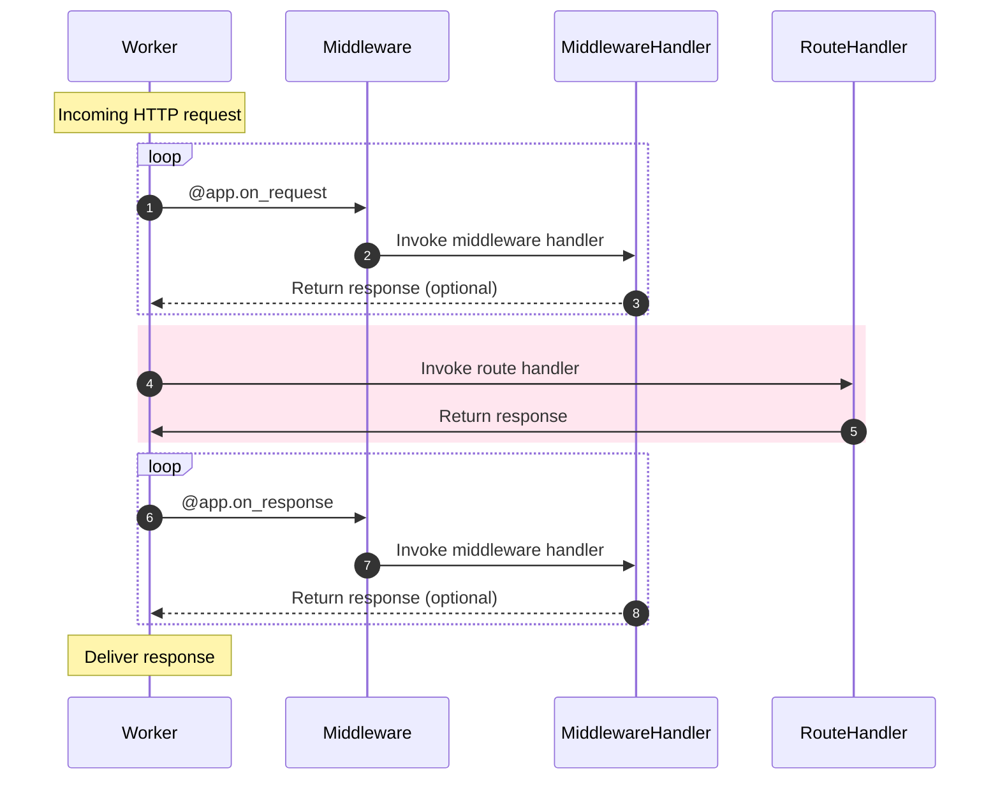

# Middleware (промежуточное ПО)

Если обработчики событий позволяют добавить некоторую функциональность к жизненному циклу воркера, то middleware позволяет добавить некоторую функциональность к жизненному циклу HTTP-потока.

Middleware могут выполняться либо _до_ выполнения хендлера, либо _после_.


## Подключение middleware

---:1

Пожалуй, это уже должно выглядеть знакомым. Все, что вам нужно сделать, это указать то событие, при котором middleware следует выполняться: `request` или `response`. :--:1
```python
async def extract_user(request):
    request.ctx.user = await extract_user_from_request(request)

app.register_middleware(extract_user, "request")
```
:---

---:1

Опять же, у экземпляра приложения `Sanic` есть для этого удобный декоратор. :--:1
```python
@app.middleware("request")
async def extract_user(request):
    request.ctx.user = await extract_user_from_request(request)
```
:---

---:1

Middleware, выполняющееся на ответе, получает в качестве аргументов и `request`, и `response`. :--:1
```python
@app.middleware('response')
async def prevent_xss(request, response):
    response.headers["x-xss-protection"] = "1; mode=block"
```
:---

---:1

Декоратор можно сократить еще больше. Это полезно, если у вас есть IDE с автозавершением.

This is the preferred usage, and is what we will use going forward.

:--:1
```python
@app.on_request
async def extract_user(request):
    ...

@app.on_response
async def prevent_xss(request, response):
    ...
```
:---

## Изменения

---:1

Middleware может изменять переданные в него параметры запроса или ответа, _так как оно их не возвращает_.

#### Порядок выполнения

1. Middleware запроса: `add_key`
2. Хендлер маршрута: `index`
3. Middleware ответа: `prevent_xss`
4. Middleware ответа: `custom_banner` :--:1
```python
@app.on_request
async def add_key(request):
    # Arbitrary data may be stored in request context:
    request.ctx.foo = "bar"


@app.on_response
async def custom_banner(request, response):
    response.headers["Server"] = "Fake-Server"


@app.on_response
async def prevent_xss(request, response):
    response.headers["x-xss-protection"] = "1; mode=block"


@app.get("/")
async def index(request):
    return text(request.ctx.foo)

```
:---


---:1 Вы можете изменить объект `request.match_info`. Пример полезного использования middleware: преобразование `a-slug` в `a_slug`. :--:1
```python
@app.on_request
def convert_slug_to_underscore(request: Request):
    request._match_info["slug"] = request._match_info["slug"].replace("-", "_")


@app.get("/<slug:[a-z0-9]+(?:-[a-z0-9]+)*>")
async def handler(request, slug):
    return text(slug)
```
```
$ curl localhost:9999/foo-bar-baz
foo_bar_baz
```
:---
## Раннее реагирование

---:1

Если middleware возвращает объект `HTTPResponse`, запрос перестанет обрабатываться, и будет возвращен ответ. Если это произойдет до того, как запрос достигнет хендлера маршрута, хендлер **не** будет вызван. Возврат ответа также предотвращает выполнение любых последующих middleware.

::: Совет Вы можете вернуть значение `None` для остановки выполнения обработчика middleware для того, чтобы запрос мог дальше обрабатываться в нормальном режиме. Это может быть полезно, например, если вы используете ранний возврат в целях избежания дальнейшей обработки запроса внутри этого middleware. ::: :--:1
```python
@app.on_request
async def halt_request(request):
    return text("I halted the request")

@app.on_response
async def halt_response(request, response):
    return text("I halted the response")
```
:---

## Порядок выполнения

Middleware запросов выполняются в порядке их объявления. Middleware ответов выполняются в **обратном порядке**.

Если мы запустим следующий код, то в консоли мы можем ожидать следующий вывод.

---:1
```python
@app.on_request
async def middleware_1(request):
    print("middleware_1")


@app.on_request
async def middleware_2(request):
    print("middleware_2")


@app.on_response
async def middleware_3(request, response):
    print("middleware_3")


@app.on_response
async def middleware_4(request, response):
    print("middleware_4")

@app.get("/handler")
async def handler(request):
    print("~ handler ~")
    return text("Done.")
```
:--:1
```bash
middleware_1
middleware_2
~ handler ~
middleware_4
middleware_3
[INFO][127.0.0.1:44788]: GET http://localhost:8000/handler  200 5
```
:---

::: new NEW in v22.9
### Middleware priority

---:1 You can modify the order of execution of middleware by assigning it a higher priority. This happens inside of the middleware definition. The higher the value, the earlier it will execute relative to other middleware. The default priority for middleware is `0`. :--:1
```python
@app.on_request
async def low_priority(request):
    ...

@app.on_request(priority=99)
async def high_priority(request):
    ...
```
:--- :::
