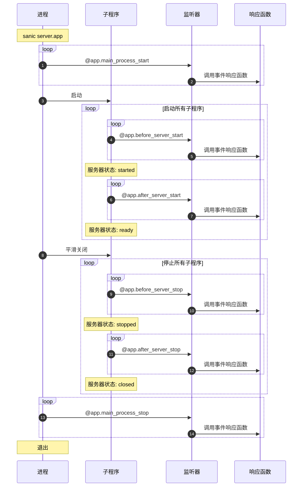

# 监听器(Listeners)

在 Sanic 应用程序的生命周期中 8 个切入点，在这些关键节点上设置监听器可以让您可以完成一些注入操作。 但是这里并不包括[信号](../advanced/signals.md)，信号允许进一步的注入定制。

有两 （2） 个切入点 _只_ 在您的主进程中触发（即，只会在 `sanic server.app` 中触发一次。）

- `main_process_start`
- `main_process_stop`

::: new v22.3 新特性

- `reload_process_start`
- `reload_process_stop`

*Added `reload_process_start` and `reload_process_stop` in v22.3*

:::

- `before_server_start`
- `after_server_start`
- `before_server_stop`
- `after_server_stop`

有四（4）个切入点可以让您在服务器启动或者关闭前执行一些初始化或资源回收相关代码。



重新加载程序的进程会存在于当前工作进程之外，位于负责启动和停止 Sanic 进程的进程之内。 下面是例子:

```python
@app.reload_process_start
async def reload_start(*_):
    print(">>>>>> reload_start <<<<<<")


@app.main_process_start
async def main_start(*_):
    print(">>>>>> main_start <<<<<<")
```

如果您的应用程序启用了自动重载功能，将会调用一次 `reload_start` 函数。 与 `main_start` 不同，`main_start` 会在每次保存文件和重载器重新启动应用时调用一次。

## 启用监听器(Attaching a listener)

---:1

将函数设置为侦听器的过程类似于声明路由。

The currently running `Sanic()` instance is injected into the listener. :--:1
```python
async def setup_db(app):
    app.ctx.db = await db_setup()

app.register_listener(setup_db, "before_server_start")
```
:---

---:1

The `Sanic` app instance also has a convenience decorator. :--:1
```python
@app.listener("before_server_start")
async def setup_db(app):
    app.ctx.db = await db_setup()
```
:---

---:1 Prior to v22.3, both the application instance and the current event loop were injected into the function. However, only the application instance is injected by default. If your function signature will accept both, then both the application and the loop will be injected as shown here. :--:1
```python
@app.listener("before_server_start")
async def setup_db(app, loop):
    app.ctx.db = await db_setup()
```
:---

---:1

您可以进一步缩短该装饰器的调用代码。 如果您的 IDE 有自动补全的话会很方便。

:--:1
```python
@app.before_server_start
async def setup_db(app):
    app.ctx.db = await db_setup()
```
:---

## 执行顺序(Order of execution)

监听器按启动期间声明的顺序正向执行，并在拆解期间按照注册顺序反向执行。

|                       | 执行阶段  | 执行顺序                    |
| --------------------- | ----- | ----------------------- |
| `main_process_start`  | 主程序启动 | 正向 :smiley:             |
| `before_server_start` | 子程序启动 | 正向 :smiley:             |
| `after_server_start`  | 子程序启动 | 正向 :smiley:             |
| `before_server_stop`  | 子程序关闭 | 反向 :upside_down_face: |
| `after_server_stop`   | 子程序关闭 | 反向 :upside_down_face: |
| `main_process_stop`   | 主程序关闭 | 反向 :upside_down_face: |

:::

---:1

```python
@app.listener("before_server_start")
async def listener_1(app, loop):
    print("listener_1")

@app.listener("before_server_start")
async def listener_2(app, loop):
    print("listener_2")

@app.listener("after_server_start")
async def listener_3(app, loop):
    print("listener_3")

@app.listener("after_server_start")
async def listener_4(app, loop):
    print("listener_4")

@app.listener("before_server_stop")
async def listener_5(app, loop):
    print("listener_5")

@app.listener("before_server_stop")
async def listener_6(app, loop):
    print("listener_6")

@app.listener("after_server_stop")
async def listener_7(app, loop):
    print("listener_7")

@app.listener("after_server_stop")
async def listener_8(app, loop):
    print("listener_8")
```
:--:1
```bash{3-7,13,19-22}
[pid: 1000000] [INFO] Goin' Fast @ http://127.0.0.1:9999
[pid: 1000000] [INFO] listener_0
[pid: 1111111] [INFO] listener_1
[pid: 1111111] [INFO] listener_2
[pid: 1111111] [INFO] listener_3
[pid: 1111111] [INFO] listener_4
[pid: 1111111] [INFO] Starting worker [1111111]
[pid: 1222222] [INFO] listener_1
[pid: 1222222] [INFO] listener_2
[pid: 1222222] [INFO] listener_3
[pid: 1222222] [INFO] listener_4
[pid: 1222222] [INFO] Starting worker [1222222]
[pid: 1111111] [INFO] Stopping worker [1111111]
[pid: 1222222] [INFO] Stopping worker [1222222]
[pid: 1222222] [INFO] listener_6
[pid: 1222222] [INFO] listener_5
[pid: 1222222] [INFO] listener_8
[pid: 1222222] [INFO] listener_7
[pid: 1111111] [INFO] listener_6
[pid: 1111111] [INFO] listener_5
[pid: 1111111] [INFO] listener_8
[pid: 1111111] [INFO] listener_7
[pid: 1000000] [INFO] listener_9
[pid: 1000000] [INFO] Server Stopped
```
在上面的例子中，注意这三个进程是如何运行的：

- `pid: 1000000` - _主_ 程序
- `pid: 1111111` - 子程序 1
- `pid: 1222222` - 子程序 2

*Just because our example groups all of one worker and then all of another, in reality since these are running on separate processes, the ordering between processes is not guaranteed. 但是，可以确定的是，在只有一个子程序的情况下，**一直** 会保持上述顺序。</p>


在实际的使用过程中，如果您定义了一个数据库连接函数，并将其注册为 `before_server_start` 的第一个监听器，那么在此之后注册的所有监听器都可以依靠该连接保持活跃状态。 :::

## ASGI 模式 (ASGI Mode)

以下列代码为例，我们在启动两个子程序并执行之后看到的输出内容应该是这样的：

- `reload_process_start` 和 `reload_process_stop` 将会被 **忽略**
- `main_process_start` 和 `main_process_stop` 将会被 **忽略**
- `before_server_start` 将会尽可能早得执行，且会在 `after_server_start` 之前，但是严格来说，服务器在这个时候已经运行了。
- `after_server_stop` 将会尽可能迟得执行，并且在 `before_server_stop` 之后，但是严格来说，服务器在这个时候还没有停止运行。
