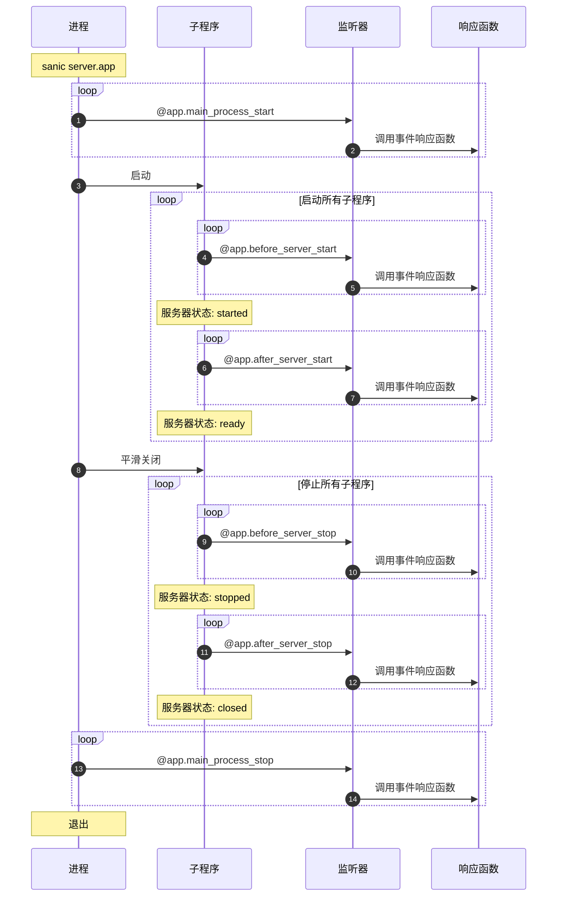

# 监听器(Listeners)

在 Sanic 应用程序的生命周期中 6 个切入点，在这些关键节点上设置监听器可以让您可以完成一些注入操作。

::: new v21.3 新增
有两 （2） 个切入点 *只* 在您的主进程中触发（即，只会在 `sanic server.app` 中触发一次。）

- `main_process_start`
- `main_process_stop`
:::

有四（4）个切入点可以让您在服务器启动或者关闭前执行一些初始化或资源回收相关代码。

- `before_server_start`
- `after_server_start`
- `before_server_stop`
- `after_server_stop`

工作流程的生命周期如下：



## 启用监听器(Attaching a listener)

---:1

将函数设置为侦听器的过程类似于声明路由。

两个注入的参数是当前正在运行 `Sanic()` 的实例和当前正在运行的循环。

:--:1

```python
async def setup_db(app, loop):
    app.db = await db_setup()

app.register_listener(setup_db, "before_server_start")
```
:---

---:1

您也可以通过装饰器的方式来将函数添加为监听器。

:--:1

```python
@app.listener("before_server_start")
async def setup_db(app, loop):
    app.db = await db_setup()
```

:---

---:1

::: new v21.3 新增

您可以进一步缩短该装饰器的调用代码。如果您的 IDE 有自动补全应该会有很有用。

:::

:--:1

```python
@app.before_server_start
async def setup_db(app, loop):
    app.db = await db_setup()
```

:---

## 执行顺序(Order of execution)

听器按启动期间声明的顺序正向执行，并在拆解期间按照注册顺序反向执行。

|                       | 执行阶段 | 执行顺序 |
| :-------------------: | :------: | :-----: |
| `main_process_start`  | 主程序启动    | 正向 :smiley: |
| `before_server_start` | 子程序启动  | 正向 :smiley: |
| `after_server_start`  | 子程序启动  | 正向 :smiley: |
| `before_server_stop`  | 子程序关闭 | 反向 :upside_down_face: |
| `after_server_stop`   | 子程序关闭 | 反向 :upside_down_face: |
| `main_process_stop`   | 主程序关闭   | 反向 :upside_down_face: |

以下列代码为例，我们在启动两个子程序并执行之后看到的输出内容应该是这样的：

---:1

```python
@app.listener("before_server_start")
async def listener_1(app, loop):
    print("listener_1")

@app.listener("before_server_start")
async def listener_2(app, loop):
    print("listener_2")

@app.listener("after_server_start")
async def listener_3(app, loop):
    print("listener_3")

@app.listener("after_server_start")
async def listener_4(app, loop):
    print("listener_4")

@app.listener("before_server_stop")
async def listener_5(app, loop):
    print("listener_5")

@app.listener("before_server_stop")
async def listener_6(app, loop):
    print("listener_6")

@app.listener("after_server_stop")
async def listener_7(app, loop):
    print("listener_7")

@app.listener("after_server_stop")
async def listener_8(app, loop):
    print("listener_8")
```

:--:1

```bash{3-7,13,19-22}
[pid: 1000000] [INFO] Goin' Fast @ http://127.0.0.1:9999
[pid: 1000000] [INFO] listener_0
[pid: 1111111] [INFO] listener_1
[pid: 1111111] [INFO] listener_2
[pid: 1111111] [INFO] listener_3
[pid: 1111111] [INFO] listener_4
[pid: 1111111] [INFO] Starting worker [1111111]
[pid: 1222222] [INFO] listener_1
[pid: 1222222] [INFO] listener_2
[pid: 1222222] [INFO] listener_3
[pid: 1222222] [INFO] listener_4
[pid: 1222222] [INFO] Starting worker [1222222]
[pid: 1111111] [INFO] Stopping worker [1111111]
[pid: 1222222] [INFO] Stopping worker [1222222]
[pid: 1222222] [INFO] listener_6
[pid: 1222222] [INFO] listener_5
[pid: 1222222] [INFO] listener_8
[pid: 1222222] [INFO] listener_7
[pid: 1111111] [INFO] listener_6
[pid: 1111111] [INFO] listener_5
[pid: 1111111] [INFO] listener_8
[pid: 1111111] [INFO] listener_7
[pid: 1000000] [INFO] listener_9
[pid: 1000000] [INFO] Server Stopped
```

在上面的例子中，注意这三个进程是如何运行的：

- `pid: 1000000` - *主* 程序
- `pid: 1111111` - 子程序 1
- `pid: 1222222` - 子程序 2

*只是为了举例，我们将两个子程序看做两组，分别顺序打印。但在实际情况下，这些都程序都运行在不同的进程中，进程执行的顺序是无法保证的。但是，可以确定的是，在只有一个子程序的情况下，**一直** 会保持上述顺序。*

:---

::: tip 小提示：

在实际的使用过程中，如果您定义了一个数据库连接函数，并将其注册为 `before_server_start` 的第一个监听器，那么在此之后注册的所有监听器都可以依靠该连接保持活跃状态。

:::

## ASGI 模式 (ASGI Mode)

如果您正在使用 ASGI 服务器来运行您的应用，那么需要关注一下以下的变化：

- `main_process_start` 和 `main_process_stop` 将会被 **忽略**
- `before_server_start` 将会尽可能早得执行，且会在 `after_server_start` 之前，但是严格来说，服务器在这个时候已经运行了。
- `after_server_stop` 将会尽可能迟得执行，并且在 `before_server_stop` 之后，但是严格来说，服务器在这个时候还没有停止运行。