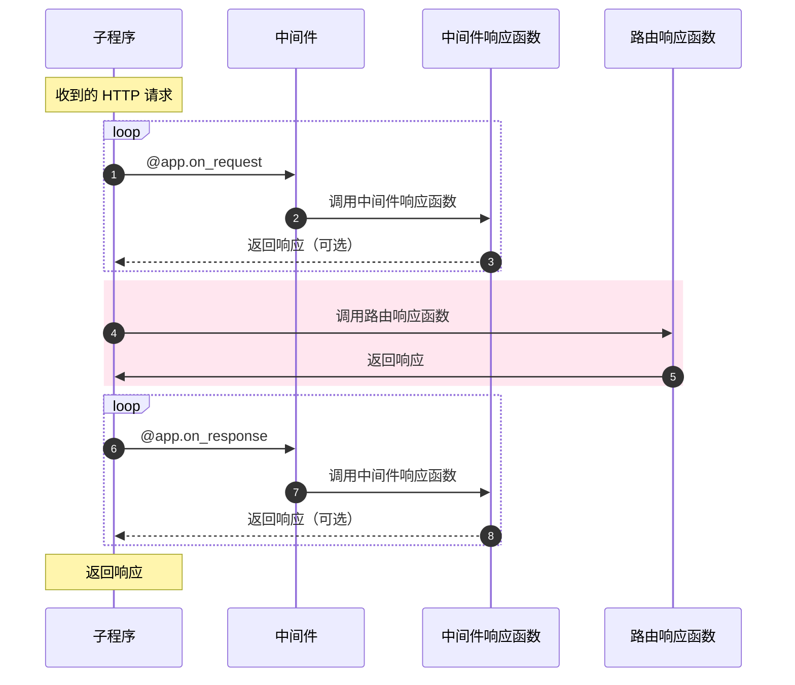

# 中间件(Middleware)

监听器允许您将功能挂载到工作进程的生命周期，而中间件允许您将功能挂载到 HTTP 流的生命周期。

您可以在执行响应函数之前或者响应函数之后执行中间件。



## 启用(Attaching middleware)

---:1

这看起来和之前的流程没有什么不同，您需要做的就是完成响应函数的构建，并将其挂载到 `request` 或  `response`  上

:--:1

```python
async def extract_user(request):
    request.ctx.user = await extract_user_from_request(request)

app.register_middleware(extract_user, "request")
```

:---

---:1

同样, 中间件一样支持使用装饰器进行挂载。

:--:1

```python
@app.middleware("request")
async def extract_user(request):
    request.ctx.user = await extract_user_from_request(request)
```

:---

---:1

响应中间件需要同时接收 `request` 和 `response` 两个参数

:--:1

```python
@app.middleware('response')
async def prevent_xss(request, response):
    response.headers["x-xss-protection"] = "1; mode=block"
```

:---

---:1

您可以进一步缩短该装饰器的调用代码。如果您的 IDE 有自动补全的话会很方便。

:--:1

```python
@app.on_request
async def extract_user(request):
    ...

@app.on_response
async def prevent_xss(request, response):
    ...
```

:---

## 变更(Modification)

---:1

如果您的中间件 *不涉及返回响应操作*，那么您可以使用中间件来修改请求参数或者响应参数。

#### 执行顺序(Order of execution)


1. 请求中间件：`add_key`
2. 响应函数：`index`
3. 响应中间件：`prevent_xss`
4. 响应中间件：`custom_banner`

:--:1

```python
@app.middleware("request")
async def add_key(request):
    # Arbitrary data may be stored in request context:
    request.ctx.foo = "bar"


@app.middleware("response")
async def custom_banner(request, response):
    response.headers["Server"] = "Fake-Server"


@app.middleware("response")
async def prevent_xss(request, response):
    response.headers["x-xss-protection"] = "1; mode=block"


@app.get("/")
async def index(request):
    return text(request.ctx.foo)

```

:---

---:1

您可以修改 `request.match_info`。这个功能可能很有用，比如下面这个例子中，在中间件里将 `a-slug` 改变为 `a_slug`。

:--:1

```python
@app.on_request
def convert_slug_to_underscore(request: Request):
    request._match_info["slug"] = request._match_info["slug"].replace("-", "_")


@app.get("/<slug:[a-z0-9]+(?:-[a-z0-9]+)*>")
async def handler(request, slug):
    return text(slug)
```
```
$ curl localhost:9999/foo-bar-baz
foo_bar_baz
```

:---

## 提前响应(Resonding early)

---:1

如果中间件返回了一个 `HTTPResponse` 对象， 那么请求将会终止，此对象将会作为最终响应进行返回。如果此操作发生在响应函数之前，那么响应函数将不会被调用。除此之外，此操作同样不会调用该中间件之后的其他中间件。

:--:1

```python
@app.middleware("request")
async def halt_request(request):
    return text("I halted the request")

@app.middleware("response")
async def halt_response(request, response):
    return text("I halted the response")
```

::: tip
您可以返回 `None` 值来跳过某个中间件的执行，如果这样的话将不影响后续中间件的执行。您可以将这个特性用于在提前响应中中间件的选择性执行。
:::

:---

#### 执行顺序(Order of execution)

请求中间件按照声明的顺序执行。响应中间件按照声明顺序的 **逆序** 执行。 在此示例中，我们可以在控制台看到如下的输出顺序。

---:1

```python
@app.middleware("request")
async def middleware_1(request):
    print("middleware_1")


@app.middleware("request")
async def middleware_2(request):
    print("middleware_2")


@app.middleware("response")
async def middleware_3(request, response):
    print("middleware_3")


@app.middleware("response")
async def middleware_4(request, response):
    print("middleware_4")
    
@app.get("/handler")
async def handler(request):
    print("~ handler ~")
    return text("Done.")
```

:--:1

```bash
middleware_1
middleware_2
~ handler ~
middleware_4
middleware_3
[INFO][127.0.0.1:44788]: GET http://localhost:8000/handler  200 5
```

:---
